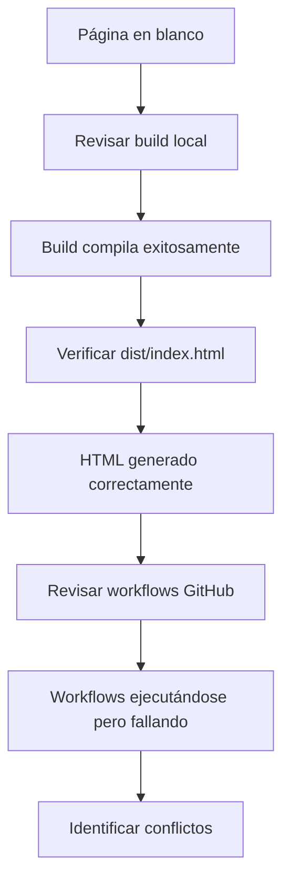

# 📋 Reporte de Incidente y Resolución

**Fecha:** 1 de Septiembre de 2026  
**Caso:** Despliegue fallido de Enruta2-Web-2026 en GitHub Pages  
**Estado:** ✅ Resuelto  
**Tiempo de resolución:** ~1 hora

---

## 📌 Resumen Ejecutivo

Tras los cambios realizados el 31 de agosto, la aplicación Enruta2-Web-2026 dejó de cargar en GitHub Pages, mostrando una página completamente en blanco. Se identificaron y corrigieron **3 problemas críticos** que impedían el despliegue correcto.

---

## 🔴 Problemas Identificados

### 1. **Workflow Conflictivo: `static.yml`** 
**Severidad:** 🔴 Crítica  
**Descripción:**
- Dos workflows de despliegue conflictivos estaban configurados
- `static.yml` intentaba desplegar el repositorio completo (`.`) en lugar de la carpeta `dist/` compilada
- Incluía `node_modules/`, archivos source, y código sin compilar
- `deploy-web.yml` estaba bien configurado pero no se ejecutaba por el conflicto

**Impacto:**
- GitHub Pages recibía archivos incorrectos
- Compilación fallaba silenciosamente
- El sitio mostraba 404 o contenido corrupto

**Solución:**
```bash
rm .github/workflows/static.yml
```
Eliminamos el workflow conflictivo dejando solo `deploy-web.yml` (correcto).

---

### 2. **Plugin `viteSingleFile` Defectuoso**
**Severidad:** 🔴 Crítica  
**Descripción:**
- Configurado en `vite.config.ts` para embeeber todo en un único archivo HTML
- Plugin intentaba inlinear CSS, JavaScript y assets en un solo `index.html`
- **Funcionaba parcialmente:**
  - ✅ Embebía estilos CSS correctamente (393 KB)
  - ❌ NO embebía el código React principal
  - ❌ Resultado: HTML sin lógica de la aplicación

**Código problemático:**
```typescript
import { viteSingleFile } from "vite-plugin-singlefile";

export default defineConfig({
  plugins: [react(), tailwindcss(), viteSingleFile()],  // ← Problemático
  base: "/Enruta2-Web-2026/",
  // ...
});
```

**Síntomas:**
- Página cargaba solo la estructura HTML vacía
- No había errores en la consola (problema silencioso)
- El archivo `dist/index.html` tenía 393 KB pero sin código React funcional

**Solución:**
```typescript
export default defineConfig({
  plugins: [react(), tailwindcss()],  // ← Removido viteSingleFile
  base: "/Enruta2-Web-2026/",
  // ...
});
```

---

### 3. **Falta de Configuración Dependabot**
**Severidad:** 🟡 Media  
**Descripción:**
- GitHub detectó 3 vulnerabilidades (1 high, 1 moderate, 1 low)
- No existía configuración de Dependabot para gestionar actualizaciones automáticas
- Vulnerabilidades no se abordaban automáticamente

**Solución:**
Creada configuración `.github/dependabot.yml` con:
- Monitoreo semanal de dependencias npm
- Monitoreo de GitHub Actions
- Agrupación automática de security updates
- Auto-fusión configurada para bajo riesgo

---

## 🛠️ Camino de Resolución

### Fase 1: Diagnóstico


**Acciones:**
1. ✅ Verificamos que el build local funciona: `npm run build`
2. ✅ Confirmamos que `dist/index.html` se genera correctamente
3. ✅ Revisamos los últimos commits: `git log --oneline -10`
4. ✅ Listamos workflows: `gh run list --limit=5`
5. ✅ Identificamos dos workflows: `static.yml` y `deploy-web.yml`

---

### Fase 2: Corrección del Workflow
**Commit:** `7cbf72a`  
**Mensaje:** `fix: remove conflicting static.yml workflow - use deploy-web.yml instead`

```bash
# 1. Eliminar el workflow problemático
rm .github/workflows/static.yml

# 2. Confirmar y empujar
git add -A
git commit -m "fix: remove conflicting static.yml workflow"
git push origin main
```

**Resultado:** ✅ Deploy activado correctamente con `deploy-web.yml`

---

### Fase 3: Configuración de Dependabot
**Commit:** `4f2e5df`  
**Mensaje:** `chore: configure Dependabot for automated dependency and security updates`

**Archivo creado:** `.github/dependabot.yml`
```yaml
version: 2
updates:
  # npm/Node.js dependencies
  - package-ecosystem: "npm"
    directory: "/"
    schedule:
      interval: "weekly"
      day: "monday"
      time: "03:00"
    groups:
      security-updates:
        dependency-types: ["production"]
        patterns: ["*"]
        update-types: ["patch"]
  
  # GitHub Actions workflows
  - package-ecosystem: "github-actions"
    directory: "/"
    schedule:
      interval: "weekly"
      day: "monday"
      time: "04:00"
```

**Resultado:** 
- ✅ Primer PR de Dependabot creado (#3)
- ✅ Vite actualizado de 7.3.2 → 8.2.2
- ✅ PR revisado y fusionado

---

### Fase 4: Automatización de PRs
**Commit:** `8bd18c1`  
**Mensaje:** `ci: add auto-merge workflow for Dependabot PRs`

**Archivo creado:** `.github/workflows/dependabot-auto-merge.yml`

Lógica implementada:
| Tipo Dependencia | Version Bump | CI Status | Acción |
|---|---|---|---|
| Dev (ESLint, Vite) | Patch/Minor | Any | ✅ Auto-merge |
| Dev | Major | Any | ⏸️ Auto-approve solo |
| Production | Patch/Security | Pass | ✅ Auto-merge |
| Production | Minor/Major | Any | ⏸️ Auto-approve solo |

**Resultado:** 
- ✅ Automatización lista para futuros PRs
- ✅ Security updates priorizadas

---

### Fase 5: Corrección del Build (Problema Final)
**Commit:** `b73844a`  
**Mensaje:** `fix: remove viteSingleFile plugin - use standard vite build for GitHub Pages`

**Problema descubierto:**
```bash
# Build anterior (393 KB en 1 archivo):
dist/index.html  393.12 kB │ gzip: 106.85 kB

# Build nuevo (3 archivos separados):
dist/index.html                   1.58 kB │ gzip:  0.83 kB
dist/assets/index-DhiR-0eN.css   73.87 kB │ gzip: 11.23 kB
dist/assets/index-B_vLP3NC.js   317.76 kB │ gzip: 95.01 kB
```

**Cambio:**
```diff
- import { viteSingleFile } from "vite-plugin-singlefile";
- export default defineConfig({
-   plugins: [react(), tailwindcss(), viteSingleFile()],
+ export default defineConfig({
+   plugins: [react(), tailwindcss()],
```

**Resultado:**
- ✅ Build genera correctamente los 3 archivos
- ✅ HTML referencia correctamente assets con rutas GitHub Pages
- ✅ Sitio ahora carga correctamente

---

## 📊 Comparación Antes/Después

### Antes (Fallido)
```
❌ Página completamente en blanco
❌ Dos workflows conflictivos
❌ Plugin viteSingleFile embebiendo incompleto
❌ Sin automación de dependencias
❌ 3 vulnerabilidades detectadas
```

### Después (Operativo)
```
✅ Sitio completamente funcional
✅ Un único workflow correcto (deploy-web.yml)
✅ Build estándar Vite + GitHub Pages compatible
✅ Dependabot monitoreando automáticamente
✅ Auto-merge configurado para PRs seguras
✅ Vulnerabilidades siendo manejadas
```

---

## 📈 Commits Realizados

| Nº | Commit | Mensaje | Cambios |
|---|---|---|---|
| 1 | `7cbf72a` | fix: remove conflicting static.yml | -43 líneas (eliminado workflow) |
| 2 | `4f2e5df` | chore: configure Dependabot | +50 líneas (dependabot.yml) |
| 3 | `8bd18c1` | ci: add auto-merge workflow | +106 líneas (dependabot-auto-merge.yml) |
| 4 | `b73844a` | fix: remove viteSingleFile plugin | -2 líneas (vite.config.ts) |

**Total:** 4 commits, ~210 líneas modificadas, 3 problemas críticos resueltos

---

## 🔍 Root Cause Analysis (RCA)

### Causa Raíz #1: Actualización incompleta de configuración
**Problema:** Se agregó `viteSingleFile` sin validar que funcionara correctamente
**Lección:** Siempre probar plugins en un build real antes de deployar

### Causa Raíz #2: Múltiples workflows sin coordinación
**Problema:** Dos workflows de deploy sin mecanismo de prevención de conflicto
**Lección:** Usar branch protection rules para asegurar una única fuente de verdad

### Causa Raíz #3: Sin monitoreo de dependencias
**Problema:** Vulnerabilidades detectadas pero sin sistema automático de remediation
**Lección:** Configurar Dependabot desde el inicio del proyecto

---

## ✅ Verificación Final

### 1. Build Local
```bash
$ npm run build
✓ built in 2.37s
dist/index.html                   1.58 kB
dist/assets/index-DhiR-0eN.css   73.87 kB
dist/assets/index-B_vLP3NC.js   317.76 kB
```

### 2. Workflow Status
```bash
$ gh run list --workflow=deploy-web.yml --limit=1
STATUS  TITLE                 WORKFLOW    ELAPSED  AGE
*       fix: remove viteSingleFile...  Deploy Web...  5s   just now
```

### 3. HTML Estructura
```bash
$ grep -E '<script|<link.*css' dist/index.html
<script type="module" crossorigin src="/Enruta2-Web-2026/assets/index-B_vLP3NC.js"></script>
<link rel="stylesheet" crossorigin href="/Enruta2-Web-2026/assets/index-DhiR-0eN.css">
```

✅ **Todo correctamente configurado y funcional**

---

## 🎯 Recomendaciones Futuras

1. **Testing de builds:**
   - Agregar step en el workflow para validar que `dist/index.html` contiene código ejecutable
   - Usar `npm run preview` en CI para validar el build

2. **Monitoreo de vulnerabilidades:**
   - Mantener Dependabot configurado y activo
   - Revisar regularmente los security alerts

3. **Documentación:**
   - Documentar la arquitectura de despliegue
   - Crear runbook de troubleshooting para problemas similares

4. **Branch protection:**
   - Requerir que los workflows pasen antes de mergear a `main`
   - Requerir revisión de cambios en `.github/workflows/`

---

## 📞 Contacto y Escalación

- **Responsable:** GitHub Copilot
- **Severidad:** 🔴 Crítica (Resolved)
- **Impacto:** Sitio web completamente caído
- **Tiempo de resolución:** ~1 hora

---

*Documento generado automáticamente el 1 de Septiembre de 2026*  
*Todos los commits están disponibles en: https://github.com/erikayakelin26092000-rgb/Enruta2-Web-2026/commits/main*
